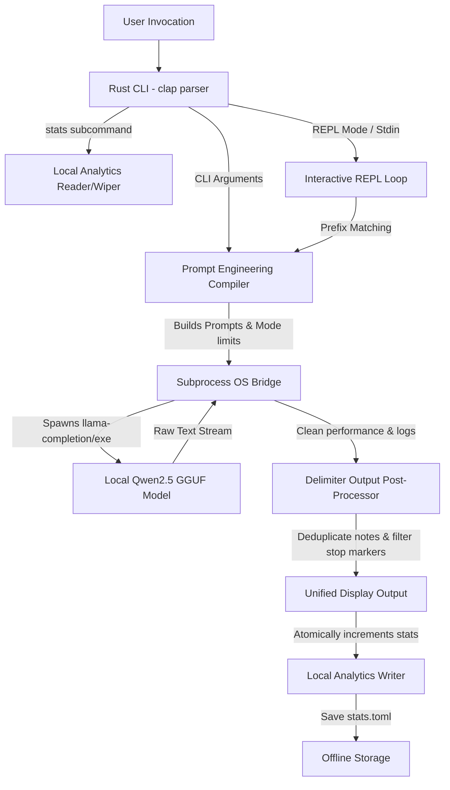
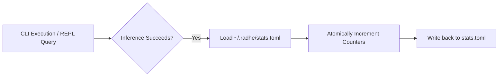

# Architectural Design - Radhe AI

This document provides a technical deep-dive into the architectural design, control flow, post-inference processing, module boundaries, and analytics of Radhe AI.

---

## 1. High-Level Design

Radhe AI is structured as a modular, offline-first student AI companion written in Rust. It interfaces with a local quantized inference engine (`llama.cpp` wrapper `llama-completion` or `llama-completion.exe`) via process pipelines and manages local user preferences and usage statistics entirely offline.



---

## 2. Component Layout & Module Map

### A. Front-End CLI parser (`Cli` & `RadheConfig` Structs)
- **Technology**: `clap` (derive-based CLI command and subcommand parsing) and `toml` serialization.
- **Subcommands**: `init` (bootstraps folders), `doctor` (diagnostic system checks), `models` (scans installed weights), `update` (cross-platform secure updater), and `stats` (prints or resets usage statistics).
- **Study Mode & Difficulty Flags**: Captured per-command via `--mode` and `--difficulty` or persisted as default values inside `~/.radhe/config.toml`.

### B. Prompt Engineering Compiler (`build_prompt` function)
- **Inputs**: Reference to the parsed `Cli` struct, target language, quiz difficulty (`easy`/`medium`/`hard`), and study mode (`normal`/`exam`/`revision`).
- **Role**: Combines student templates and language rules, and dynamically adjusts the generation guidelines:
  - **Study Modes**:
    - `exam` mode injects strict length restrictions (max 2-3 sentences) and deletes conceptual preambles.
    - `revision` mode formats definitions as highly concise, bullet-style memory aids.
  - **Quiz Difficulty**:
    - `easy` focuses on factual recall and literal comprehension from notes.
    - `hard` forces the model to test synthesis, critical thinking, and produce extremely plausible distractors for MCQs.

### C. Local Subprocess OS Bridge (`run_inference` function)
- **Execution Boundary**: Resolves the runner binary name dynamically at runtime depending on the operating system (`llama-completion.exe` on Windows and `llama-completion` on Linux/macOS) and spawns it:
  - `-m` (path to model file in `~/.radhe/models/`).
  - `-p` (compiled stateless prompt).
  - `-n` (maximum token generation limit resolved from target mode settings).
  - `--temp 0.2` (low temperature threshold for deterministic student explanations).
  - `NO_COLOR=1` environment variable (plain text response parsing).

---

## 3. Delimiter-Based Output Post-Processing

A major engineering challenge of local offline LLM completions is ensuring that model responses are clean, free of terminal log-lines, and prompt echoes. Radhe AI utilizes a robust, two-tiered echo-stripping strategy:

### A. Delimiter Injection
Before executing subprocess calls, specific delimiter markers are appended to the prompts to act as clear start indicators for the model:
- **General Modes**: Appends `\n\n### RESPONSE:\n`
- **Compiler Fix Mode**: Appends `FIXED CODE:\n`

### B. Post-Processing Algorithm
1. Spawns child process, waits, and captures the raw text output.
2. Filters out standard `llama.cpp` metrics and logs (e.g., lines starting with performance markers `"0."`).
3. Executes a split comparison check:
   - Slices out everything after `"### RESPONSE:"` or `"FIXED CODE:"` depending on the active mode.
   - **Fallback Logic**: If delimiters are absent, normalizes backslash sequences (`\\n` -> `\n`, `\\t` -> `\t`) and conducts an escape-sequence-normalized comparison index search of the prompt text against the raw output to locate the response slice.

---

## 4. Syntax & Stop Marker Truncators

To guarantee beautiful shell formatting without conversational spillover:
- **Markdown Block Stripping**: Scrapes out block markdown wrappers (e.g. ```rust, ```c) to keep returned code clean and ready for direct compilation.
- **Stop Markers**: Instantly breaks output assembly if the line begins with common explanation headers (`Explanation:`, `explanation:`, `// Explanation`, `# Explanation`).
- **EOF Stripping**: Sweeps out trailing `[end of text]` tokens from final strings.

---

## 5. Local Analytics Engine

To preserve complete student privacy while offering valuable usage insights, Radhe AI implements a 100% offline usage tracking engine:



- **Data Integrity**: Uses `toml` serialization to store strictly count integers (`total_commands`, `explain_count`, `code_count`, etc.) inside `~/.radhe/stats.toml`. No student prompt text or user content is ever saved.
- **Pack Usage**: Records custom subject pack usage inside a sorted `[pack_usage]` mapping table.
- **Reset Security**: `radhe stats --reset` prompts with a secure `[y/N]` confirmation flow before completely wiping `stats.toml`.
