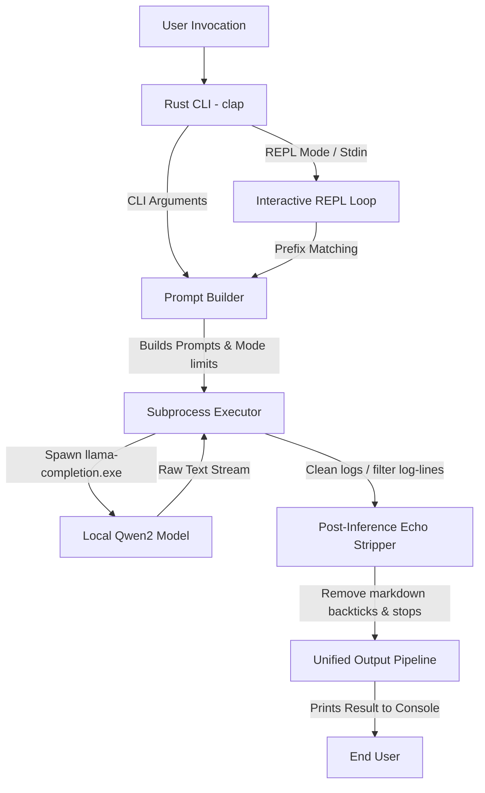

# Architectural Design - Radhe AI

This document provides a technical deep-dive into the architectural design, control flow, post-inference processing, and module boundaries of Radhe AI.

---

## 1. High-Level Design

Radhe AI is a modular, offline-first command-line assistant structured as a lightweight Rust application interacting with a local C++ inference engine (`llama.cpp`-based `llama-completion.exe`) via process pipelines:



---

## 2. Component Layout & Module Map

### A. Front-End CLI parser (`Cli` Struct)
* **Technology**: `clap` (derive-based command parsing).
* **Role**: Captures subcommands (`init`, `doctor`), custom model overrides, max-token modifications, and mode flags (`--code`, `--explain`, `--notes`, `--fix`).
* **Defaults**: Uses `"qwen2"` as the default local GGUF model and `256` as the standard fallback token size.

### B. Prompt Engineering Compiler (`build_prompt` function)
* **Inputs**: Reference to the parsed `Cli` struct.
* **Role**: Validates and routes target modes, formats standard student templates, and applies logic filters.
* **Pre-inference Filter in Fix Mode**:
  - Automatically reads targeted file paths.
  - Strips out comment line segments containing `// bug:` or `# bug:` before injecting content into the prompt structure to ensure student exercises remain clean.

### C. Local Subprocess Bridge (`run_inference` function)
* **Execution Boundary**: Runs `llama-completion.exe` as a subprocess with:
  - `-m` (home directory resolved model path: `~/.radhe/models/<model>.gguf`).
  - `-no-cnv` (stateless execution mode).
  - `--temp 0.2` (low temperature threshold for deterministic coding responses).
  - `NO_COLOR` environment variable set to `1` (neutral ASCII text parsing).
* **Stderr/Stdout Capturing**: Pipes both outputs and evaluates standard stdout. If empty, falls back to stderr error log returns.

---

## 3. Delimiter-Based Output Post-Processing

One of the core challenges of integrating local LLM text completion models is the potential echoing of the input prompt in stdout. Radhe AI utilizes a robust, two-tiered echo-stripping strategy to ensure only the generated response is shown:

### A. Delimiter Injection
Before executing subprocess calls, specific delimiter triggers are appended to the system prompts depending on the mode:
* **All Modes (except Fix)**: Appends `\n\n### RESPONSE:\n` to act as an explicit answer start boundary.
* **Fix Mode**: Appends `FIXED CODE:\n` to the system prompt to trigger immediate code correction.

### B. Post-Processing Algorithm
1. Spawns child process, waits, and captures the raw text output.
2. Filters out standard `llama.cpp` metrics and initialization logs (e.g. lines starting with performance markers `"0."`).
3. Executes a split comparison check:
   * Looks for `"### RESPONSE:"` and slices everything after it.
   * Looks for `"FIXED CODE:"` and slices everything after it.
   * **Fallback Logic**: If delimiters are absent (due to context truncation or generation errors), normalizes any backslash sequences (`\\n` -> `\n`, `\\t` -> `\t`) and conducts an escape-sequence-normalized comparison index search of the prompt text against the raw output to locate the response slice.

---

## 4. Syntax & Stop Marker Truncators

To guarantee beautiful shell formatting without conversational spillover:
* **Markdown Block Stripping**: Scrapes out boundaries (e.g., ```rust, ```c, ```) to keep returned files clean for execution.
* **Stop Markers**: Breaks output assembly immediately if the line begins with common explanation headers:
  - `Explanation:`
  - `explanation:`
  - `// Explanation`
  - `# Explanation`
* **EOF Stripping**: Recursively sweeps out `[end of text]` tokens from final strings.
